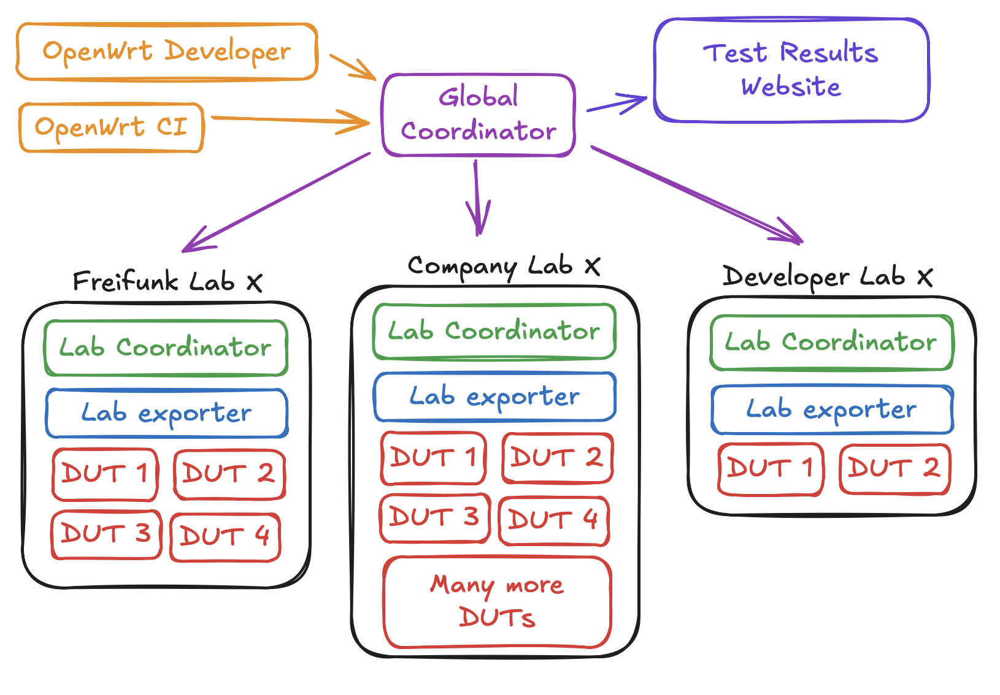
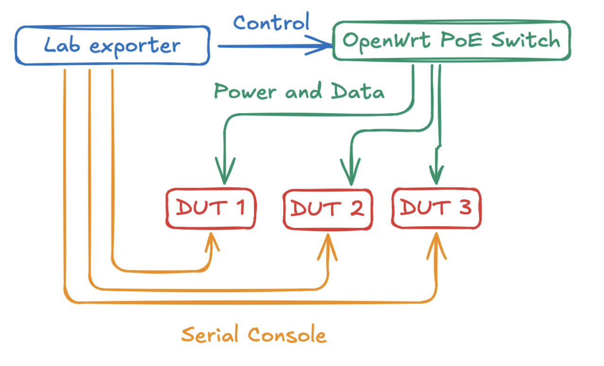

# OpenWrt Testing

> With great many support devices comes great many tests

OpenWrt Testing is a framework to run tests on OpenWrt devices, emulated or
real. Using [`labgrid`](https://labgrid.readthedocs.io/en/latest/) to control
the devices, the framework offers a simple way to write tests and run them on
different hardware.

## Testing

This section provides information on how to run tests using OpenWrt Testing,
either on real or emulated devices. If you want to deploy real devices for
testing, please see the *Lab Setup* section..

### Requirements

There are multiple ways to run tests, on real or emulated devices.

- An OpenWrt firmware image
- Python and [`uv`](https://docs.astral.sh/uv/)
- QEMU (for emulated devices)

### Setup

For maximum convenience, clone the repository inside the `openwrt.git`
repository as `tests/`:

```shell
cd /path/to/openwrt.git/
git clone https://github.com/aparcar/openwrt-tests.git tests/
```

Install required packages to use Labgrid and QEMU:

```shell
curl -LsSf https://astral.sh/uv/install.sh | sh

sudo apt-get update
sudo apt-get -y install \
    qemu-system-mips \
    qemu-system-x86 \
    qemu-system-aarch64 \
    make
```

Verify the installation by running the tests:

```shell
make tests/setup V=s
```

## Running tests

You can run tests via the Makefile or directly using `pytest`.

### Using the Makefile

You can start runtime and shell tests via the Makefile.

```shell
cd /path/to/openwrt.git
make tests/x86-64 V=s
```

### Standalone usage

If you don't plan to clone this repository inside the `openwrt.git` repository,
you can still run the tests. Use this command to run tests on `malta/be` image:

```shell
pytest tests/ \
    --lg-env targets/qemu-malta-be.yaml \
    --lg-log \
    --log-cli-level=CONSOLE \
    --lg-colored-steps \
    --firmware ../../openwrt/bin/targets/malta/be/openwrt-malta-be-vmlinux-initramfs.elf
```

## Writing tests

The framework uses `pytest` to execute commands and evaluate the output. Test
cases use the two _fixture_ `ssh_command` or `shell_command`. The object offers
the function `run(cmd)` and returns _stdout_, _stderr_ (SSH only) and the exit
code.

The example below runs `uname -a` and checks that the device is running
_GNU/Linux_

```python
def test_uname(shell_command):
    assert "GNU/Linux" in shell_command.run("uname -a")[0][0]
```

## Remote Access

With *labgrid*, you can remotely access devices. Key capabilities include
**power control**, **console**, and **SSH access**.

To enable remote access, you need SSH access with forwarding enabled on the host
exporting the device. For example, to reach the device `openwrt-one` located in
the lab `labgrid-aparcar`, you must have access to both the `labgrid-aparcar`
host and use the `global-coordinator` as a jump host:

```shell
global-coordinator -> labgrid-aparcar -> openwrt-one
```

You can request access to existing labs or contribute your own. To do this,
submit a pull request modifying the `labnet.yaml` file.

To access a remote device, configure the following environment variables.
Notably, `LG_PROXY` sets the proxy host (always the lab name):

```shell
export LG_IMAGE=~/firmware/openwrt-ath79-generic-tplink_tl-wdr3600-v1-initramfs-kernel.bin # Firmware to boot
export LG_PLACE=aparcar-tplink_tl-wdr3600-v1 # Target device, formatted as <lab>-<device>
export LG_PROXY=labgrid-aparcar # Proxy to use, typically the lab name
export LG_ENV=targets/tplink_tl-wdr3600-v1.yaml # Environment definition
```

To avoid interference from CI or other developers, lock the device before use:

```shell
uv run labgrid-client lock
```

Once locked, you can power-cycle the device and access its console:

```shell
uv run labgrid-client power cycle
uv run labgrid-client console
```

To bring the device into a specific state—such as booting your firmware defined
by `LG_IMAGE`—use a state definition:

```shell
uv run labgrid-client --state shell console
```

You can also run local tests directly on the remote device:

```shell
pytest tests/ --log-cli-level=CONSOLE
```

Lastly, unlock your device when you're done:

```shell
uv run labgrid-client unlock
```

## Lab Setup

Setting up a new lab involves several steps and is a fun and curious process,
however some precise and forward thinking is required to ensure a successful
setup. This section describes a low-cost setup usable for network communities
and individuals. Larger setups will be added in the future.

### Concept

The general idea is to have independent labs (i.e. coordinator and exporter) and
connect them over a global coordinator, which has access to all labs. Developers
and CI can access individual labs over the global coordinator, the graphic below
gives an idea.



This decentralized approach allows labs to function even if the global
coordinator is down. Also access management can be individually controlled, i.e.
which developer may access which lab or at what time automated CIs run tests.

### Requirements

* Coordinator/Exporter (i.e **RaspberryPi 5**)
* PoE switch (i.e. **Zyxel GS1900-8HP**)
* PoE Splitter (12v, 5v, etc.)
* Devices-Under-Test (DUTs)
* Some cables
* A guest wifi

### Setup

For a minimal setup, a single device runs the coordinator and exporter at the
same time, from now on called controller. The controller is connected to a PoE
switch, managing network and power. A serial to USB-to-serial converter is
needed for each *Device Under Test* (DUT) as well as a PoE splitter.

> [!NOTE]
> Larger setups may run multiple exporters, each connected to a separate PoE
> switch.



### Conroller

The controller should be setup via Ansible, which install `labgrid` as well as
all required tools.
